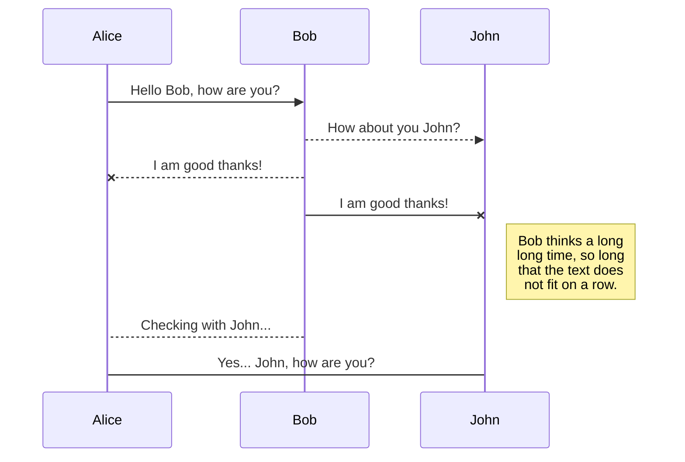

# CRM django

[](https://travis-ci.org/joemccann/dillinger)

Aplicativo CRM (Customer Relationship Management) para el registro, almacenamiento y seguimiento de clientes.

## UML diagrams

You can render UML diagrams using [Mermaid](https://mermaidjs.github.io/). For example, this will produce a sequence diagram:



## Postgres

Ingresar a postgres

```
sudo -u postgres psql
```

Listar usuarios

```
\du
```

Crear o modificar contraseña de usuario por defecto

```
ALTER USER postgres WITH password 'password';
```

Crear base de datos

```
CREATE DATABASE dcrm
    WITH
    OWNER = postgres
    ENCODING = 'UTF8'
    LC_COLLATE = 'es_PE.UTF-8'
    LC_CTYPE = 'es_PE.UTF-8'
    TABLESPACE = pg_default
    CONNECTION LIMIT = -1
    IS_TEMPLATE = False;
```

## Installation

EL CMR requiere python 3 [Python](https://www.python.org/).

Instalación y configuraciones necesarias

Creando virtualenviroment de python

```sh
cd pythonProjects
python3 -m venv virt
```

Activando el entorno irtual

```sh
cd pythonProjects
source virt/bin/activate
```
Instalando Django

```sh
cd pythonProjects
pip install django
```
Instalando posgres connector

```sh
cd pythonProjects
pip install psycopg2-binary
```

Creando el projecto

```sh
cd pythonProjects
django-admin startproject dcrm
```
Creando la página inicial

```sh
cd pythonProjects/dcrm
python manage.py startapp website
``
Configurado el servidor y la base de datos en `settings.py` realizar la migración

```sh
cd pythonProjects/dcrm
python manage.py migrate
``

## Crear usuario
```sh
cd pythonProjects/dcrm
python3 manage.py createsuperuser
``
## Run Server
```sh
cd pythonProjects/dcrm
python3 manage.py runserver
``


